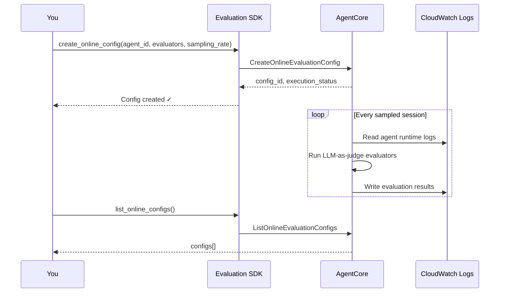
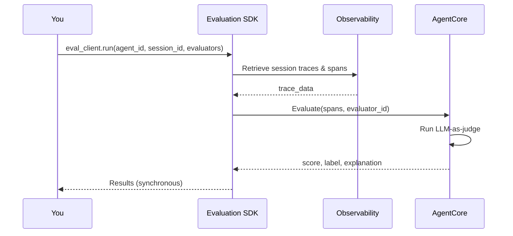
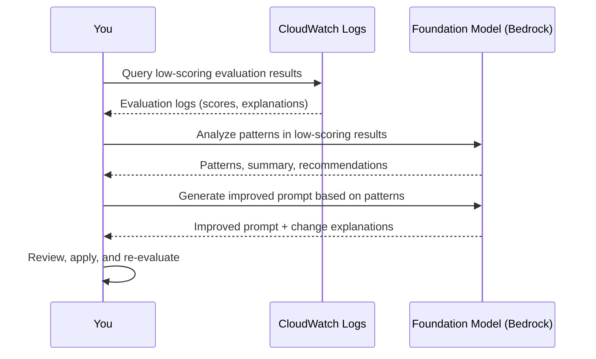
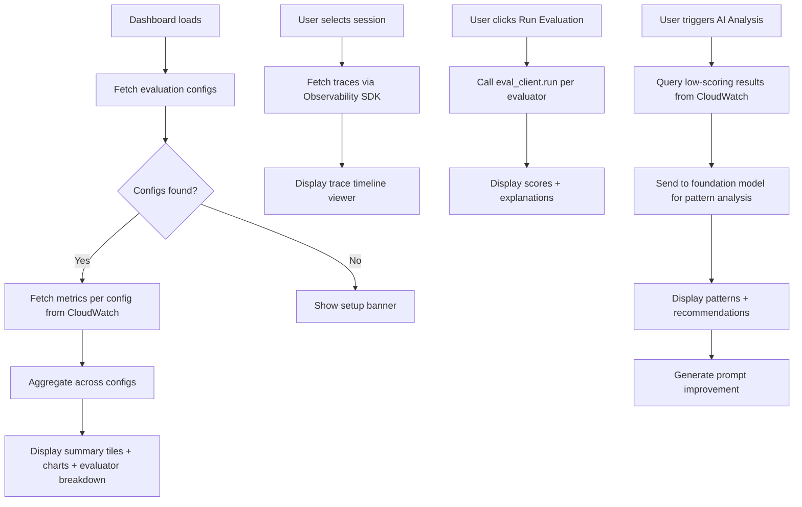

# Amazon Bedrock AgentCore Evaluations Guide

This guide covers how to use Amazon Bedrock AgentCore's evaluation capabilities to assess and monitor AI agent performance. It includes instructions for launching on-demand evaluations, configuring online (live) evaluations, understanding available metrics, downloading results, using AI-powered analysis to improve your agent, and building dashboards.

---

## Table of Contents

1. [Prerequisites](#prerequisites)
2. [SDK Installation](#sdk-installation)
3. [Online (Live) Evaluations](#online-live-evaluations)
4. [On-Demand Evaluations](#on-demand-evaluations)
5. [Built-in Evaluators Reference](#built-in-evaluators-reference)
6. [Custom Evaluators](#custom-evaluators)
7. [Evaluation Results & Format](#evaluation-results--format)
8. [Downloading & Querying Results](#downloading--querying-results)
9. [AI-Powered Analysis](#ai-powered-analysis)
10. [Retrieving Sessions, Traces & Spans (Observability)](#retrieving-sessions-traces--spans-observability)
11. [Building a Dashboard](#building-a-dashboard)
12. [Best Practices](#best-practices)
13. [References](#references)

---

## Prerequisites

- An Amazon Bedrock AgentCore runtime with a deployed agent
- AWS credentials with permissions for:
  - `bedrock-agentcore:*` (control and data plane)
  - `iam:CreateRole`, `iam:AttachRolePolicy`, `iam:PutRolePolicy`, `iam:GetRole`, `iam:PassRole` (scoped to `AgentCoreEvalsSDK-*` roles)
  - `logs:DescribeLogGroups`, `logs:FilterLogEvents`, `logs:GetLogEvents` (for evaluation result log groups)
  - `bedrock:InvokeModel` (for LLM-as-judge evaluations)
- Python 3.10+ with boto3

> **Region availability:** Cross-region inference profiles (e.g., `us.anthropic.claude-sonnet-4-5-20250929-v1:0`) are system-defined and use an empty account ID in the ARN. Your IAM policy must include both `arn:aws:bedrock:*:*:inference-profile/*` and `arn:aws:bedrock:*::inference-profile/*` to cover account-level and system-level profiles. Check [Bedrock supported regions](https://docs.aws.amazon.com/bedrock/latest/userguide/bedrock-regions.html) for model availability.

### IAM Policy Example

```json
{
  "Version": "2012-10-17",
  "Statement": [
    {
      "Effect": "Allow",
      "Action": [
        "bedrock-agentcore:CreateEvaluator",
        "bedrock-agentcore:ListEvaluators",
        "bedrock-agentcore:GetEvaluator",
        "bedrock-agentcore:UpdateEvaluator",
        "bedrock-agentcore:DeleteEvaluator",
        "bedrock-agentcore:CreateOnlineEvaluation",
        "bedrock-agentcore:ListOnlineEvaluations",
        "bedrock-agentcore:GetOnlineEvaluation",
        "bedrock-agentcore:UpdateOnlineEvaluation",
        "bedrock-agentcore:DeleteOnlineEvaluation",
        "bedrock-agentcore:Evaluate",
        "bedrock-agentcore:ListEvaluationResults"
      ],
      "Resource": "*"
    },
    {
      "Effect": "Allow",
      "Action": [
        "iam:CreateRole",
        "iam:AttachRolePolicy",
        "iam:PutRolePolicy",
        "iam:GetRole",
        "iam:PassRole"
      ],
      "Resource": "arn:aws:iam::*:role/AgentCoreEvalsSDK-*"
    },
    {
      "Effect": "Allow",
      "Action": [
        "logs:DescribeLogGroups",
        "logs:FilterLogEvents",
        "logs:GetLogEvents"
      ],
      "Resource": "arn:aws:logs:*:*:log-group:/aws/bedrock-agentcore/evaluations/*"
    },
    {
      "Effect": "Allow",
      "Action": [
        "bedrock:InvokeModel"
      ],
      "Resource": [
        "arn:aws:bedrock:*:*:inference-profile/*",
        "arn:aws:bedrock:*::inference-profile/*"
      ]
    }
  ]
}
```

---

## SDK Installation

Install the AgentCore starter toolkit:

```bash
pip install bedrock-agentcore-starter-toolkit
```

Initialize the evaluation client:

```python
from bedrock_agentcore_starter_toolkit import Evaluation

eval_client = Evaluation(region="us-east-1")
```

---

## Online (Live) Evaluations

Online evaluations continuously monitor your agent by sampling a percentage of live sessions and running evaluators automatically. Results are written to CloudWatch Logs.



### Create an Online Evaluation Config

Use this when you want to start continuously monitoring your agent's quality in a given environment.

> **Note:** `auto_create_execution_role=True` is what triggers automatic IAM role creation. The SDK creates a role named `AgentCoreEvalsSDK-{region}-{hash}` with permissions to read your agent's CloudWatch logs and invoke Bedrock models for LLM-as-judge scoring.

```python
from bedrock_agentcore_starter_toolkit import Evaluation

eval_client = Evaluation(region="us-east-1")

# agent_id is the last segment of your runtime ARN
# e.g., "my-agent-abc123" from "arn:aws:bedrock-agentcore:us-east-1:123456789:runtime/my-agent-abc123"
agent_id = "my-agent-abc123"  # Replace with your actual agent ID

response = eval_client.create_online_config(
    agent_id=agent_id,
    config_name="production_eval",
    sampling_rate=10.0,                    # Evaluate 10% of sessions
    evaluator_list=[
        "Builtin.Helpfulness",
        "Builtin.Correctness",
        "Builtin.GoalSuccessRate",
    ],
    config_description="Production evaluation with core metrics",
    auto_create_execution_role=True,       # Creates IAM role automatically
    enable_on_create=True,                 # Start evaluating immediately
)

config_id = response["onlineEvaluationConfigId"]  # Save this — you'll need it to query metrics
print(f"Created config: {config_id}")
print(f"Status: {response['executionStatus']}")
```

> **Timing:** Config creation typically completes in 10–30 seconds. Evaluation results start appearing in CloudWatch 2–5 minutes after your agent handles its next session.

### Enable / Disable an Online Evaluation

Use this to temporarily pause evaluations without losing the configuration (e.g., during maintenance windows or cost control).

```python
# Disable evaluation (pause without deleting)
eval_client.update_online_config(
    config_id="your-config-id",  # Replace with actual config ID
    execution_status="DISABLED"
)

# Re-enable evaluation
eval_client.update_online_config(
    config_id="your-config-id",
    execution_status="ENABLED"
)
```

### Update Sampling Rate

Use this to adjust cost vs. coverage tradeoff without recreating the config.

```python
eval_client.update_online_config(
    config_id="your-config-id",
    sampling_rate=5.0  # Reduce to 5% for cost savings
)
```

### List All Configs

```python
configs = eval_client.list_online_configs()
for config in configs.get("onlineEvaluationConfigs", []):
    print(f"{config['onlineEvaluationConfigName']}: {config['executionStatus']} "
          f"(sampling: {config.get('samplingRate', 'N/A')}%)")
```

### Delete a Config

```python
eval_client.delete_online_config(config_id="your-config-id")
```

---

## On-Demand Evaluations

On-demand evaluations let you evaluate a specific session immediately and get results back synchronously. The SDK retrieves the session's traces from AgentCore Observability automatically.



### Evaluate a Single Session

Use this to spot-check a specific conversation, debug a user-reported issue, or validate agent behavior after a prompt change.

> **Timing:** Each evaluator takes 5–15 seconds per session. Running 3 evaluators on one session typically completes in 15–45 seconds.

```python
from bedrock_agentcore_starter_toolkit import Evaluation

eval_client = Evaluation(region="us-east-1")

agent_id = "my-agent-abc123"      # Replace with your actual agent ID
session_id = "session-456"         # Replace with actual session ID

# Run one or more evaluators against a session
results = eval_client.run(
    agent_id=agent_id,
    session_id=session_id,
    evaluators=["Builtin.Helpfulness", "Builtin.Correctness"]
)

for result in results.results:
    print(f"Evaluator: {result.evaluator_name}")
    print(f"  Score:       {result.value:.2f}")
    print(f"  Label:       {result.label}")
    print(f"  Explanation: {result.explanation}")
    if hasattr(result, 'token_usage') and result.token_usage:
        print(f"  Tokens:      {result.token_usage}")
    print()
```

### Evaluate Using the Low-Level boto3 API

Use this when you need fine-grained control — for example, evaluating specific spans rather than an entire session, or when you've already retrieved spans yourself.

```python
import boto3

bedrock_agentcore = boto3.client("bedrock-agentcore")

response = bedrock_agentcore.evaluate(
    evaluatorId="Builtin.Helpfulness",
    evaluationInput={
        "sessionSpans": [
            {
                "traceId": "abc123",
                "spanId": "def456",
                "name": "agent_response",
                "startTimeUnixNano": 1708128000000000000,
                "endTimeUnixNano": 1708128001000000000,
                "attributes": {
                    "session.id": "session-456"
                },
                "status": {"code": "OK"},
                "scope": {"name": "bedrock-agentcore"}
            }
        ]
    },
    evaluationTarget={
        "traceIds": ["abc123"],    # Optional: scope to specific traces
        "spanIds": ["def456"]      # Optional: scope to specific spans
    }
)

for result in response.get("evaluationResults", []):
    print(f"Score: {result['value']}, Label: {result['label']}")
    print(f"Explanation: {result['explanation']}")
```

### Batch Evaluation (Multiple Sessions)

Use this to evaluate a set of sessions after a prompt change or deployment, to compare before/after quality.

> **Timing:** Batch evaluation is sequential — expect ~10 seconds per session per evaluator. Evaluating 10 sessions with 2 evaluators takes roughly 3–4 minutes.

```python
agent_id = "my-agent-abc123"
session_ids = ["session-001", "session-002", "session-003"]  # Replace with actual IDs
evaluators = ["Builtin.Helpfulness", "Builtin.Correctness"]

all_results = []
for session_id in session_ids:
    try:
        results = eval_client.run(
            agent_id=agent_id,
            session_id=session_id,
            evaluators=evaluators
        )
        all_results.append({
            "session_id": session_id,
            "results": [
                {
                    "evaluator": r.evaluator_name,
                    "score": r.value,
                    "label": r.label,
                    "explanation": r.explanation
                }
                for r in results.results
            ]
        })
    except Exception as e:
        print(f"Failed to evaluate {session_id}: {e}")

print(f"Evaluated {len(all_results)} sessions successfully")
```

---

## Built-in Evaluators Reference

AgentCore provides 15 built-in evaluators across three evaluation levels.

### Evaluation Level Decision Tree

| Your Goal | Use This Level | Why |
|---|---|---|
| Measure overall task completion | SESSION | Evaluates the entire conversation end-to-end |
| Assess individual response quality | TRACE | Evaluates each agent turn independently |
| Validate tool usage correctness | TOOL_CALL | Evaluates specific tool invocations |

### Quality & Relevance (TRACE level)

| Evaluator ID | What It Measures |
|---|---|
| `Builtin.Helpfulness` | How useful and valuable the response is from the user's perspective |
| `Builtin.Correctness` | Whether the information in the response is factually accurate |
| `Builtin.Faithfulness` | Whether the response stays true to the provided context without hallucination |
| `Builtin.Coherence` | Logical flow and consistency of the response |
| `Builtin.Conciseness` | Whether the response is appropriately brief without unnecessary information |
| `Builtin.InstructionFollowing` | Whether the response adheres to all explicit instructions in the user's input |
| `Builtin.ContextRelevance` | How relevant the retrieved context is to the user's query |
| `Builtin.ResponseRelevance` | How well the response addresses the specific question or request |

### Safety (TRACE level)

| Evaluator ID | What It Measures |
|---|---|
| `Builtin.Harmfulness` | Detects potentially harmful or unsafe content in responses |
| `Builtin.Maliciousness` | Identifies malicious intent or attempts to manipulate users |
| `Builtin.Stereotyping` | Detects stereotypical or biased language in responses |
| `Builtin.Refusal` | Tracks when the agent appropriately refuses inappropriate requests |

### Tool Usage (TOOL_CALL level)

| Evaluator ID | What It Measures |
|---|---|
| `Builtin.ToolSelectionAccuracy` | Whether the agent selected the correct tools for the task |
| `Builtin.ToolParameterAccuracy` | Whether the agent used tools with correct parameters |

### Session-Level

| Evaluator ID | What It Measures |
|---|---|
| `Builtin.GoalSuccessRate` | Whether the agent successfully completed all user goals in the conversation |

### Evaluator Selection Guide

Use this matrix to decide which evaluators to enable based on your use case:

| Use Case | Recommended Evaluators |
|---|---|
| General-purpose chatbot | `Helpfulness`, `Correctness`, `GoalSuccessRate` |
| RAG / knowledge retrieval | `Faithfulness`, `ContextRelevance`, `Correctness` |
| Tool-using agent | `ToolSelectionAccuracy`, `ToolParameterAccuracy`, `GoalSuccessRate` |
| Safety-critical application | `Harmfulness`, `Maliciousness`, `Stereotyping`, `Refusal` |
| Instruction-following tasks | `InstructionFollowing`, `Coherence`, `Conciseness` |

### Listing Available Evaluators Programmatically

```python
evaluators = eval_client.list_evaluators()
for evaluator in evaluators.get("evaluatorSummaries", []):
    print(f"{evaluator['evaluatorId']}: {evaluator.get('evaluatorName', '')}")
```

---

## Custom Evaluators

Use custom evaluators when built-in ones don't cover your domain-specific quality criteria (e.g., financial accuracy, medical safety, brand voice compliance).

```python
import boto3

control_client = boto3.client("bedrock-agentcore-control")

response = control_client.create_evaluator(
    evaluatorName="domain_accuracy",
    description="Evaluates domain-specific accuracy for financial queries",
    evaluationLevel="TRACE",
    inferenceConfig={
        "modelId": "us.anthropic.claude-sonnet-4-5-20250929-v1:0",
        "maxTokens": 500,
        "temperature": 1.0
    },
    instructions="""Evaluate the agent's response for domain-specific accuracy 
in financial contexts. Consider:
1. Are financial terms used correctly?
2. Are calculations accurate?
3. Are regulatory references correct?

{{input}} {{output}}""",
    ratingScale={
        "type": "NUMERIC",
        "min": 0.0,
        "max": 1.0,
        "description": "0 = completely inaccurate, 1 = fully accurate"
    }
)

evaluator_arn = response["evaluatorArn"]
print(f"Created custom evaluator: {evaluator_arn}")
```

Custom evaluators can then be used in both online and on-demand evaluations just like built-in ones.

---

## Evaluation Results & Format

### Online Evaluation Results (CloudWatch Logs)

Online evaluation results are written to CloudWatch Logs at:

```
/aws/bedrock-agentcore/evaluations/results/{config-id}
```

> **Note:** The log group name uses the config ID (e.g., `a1b2c3d4-...`), not the config name. You can find the config ID from `create_online_config()` response or `list_online_configs()`.

Each log event contains a JSON object with OpenTelemetry-style attributes:

```json
{
  "attributes": {
    "gen_ai.evaluation.name": "Builtin.Helpfulness",
    "gen_ai.evaluation.score.value": 0.83,
    "gen_ai.evaluation.score.label": "Very Helpful",
    "gen_ai.evaluation.explanation": "The response directly addresses the user's question with relevant and actionable information..."
  },
  "traceId": "abc123def456",  // pragma: allowlist secret (example placeholder, not a real secret)
  "spanId": "789ghi",
  "sessionId": "session-456",
  "timestamp": "2026-02-17T00:42:42.086Z"
}
```

### Key Fields

| Field | Description |
|---|---|
| `attributes.gen_ai.evaluation.name` | Evaluator ID (e.g., `Builtin.Helpfulness`) |
| `attributes.gen_ai.evaluation.score.value` | Numeric score from 0.0 to 1.0 |
| `attributes.gen_ai.evaluation.score.label` | Human-readable label (e.g., "Very Helpful") |
| `attributes.gen_ai.evaluation.explanation` | Detailed reasoning for the score |
| `traceId` | The trace that was evaluated |
| `spanId` | The specific span that was evaluated |
| `sessionId` | The agent session ID |

### On-Demand Evaluation Results

On-demand results are returned synchronously in the API response:

```json
{
  "evaluatorId": "Builtin.Helpfulness",
  "evaluatorName": "Builtin.Helpfulness",
  "value": 0.83,
  "label": "Very Helpful",
  "explanation": "The response directly addresses...",
  "tokenUsage": {
    "inputTokens": 958,
    "outputTokens": 211,
    "totalTokens": 1169
  }
}
```

---

## Downloading & Querying Results

### Query Results from CloudWatch (Python)

Use this to pull evaluation results for analysis, export, or dashboard display.

> **CloudWatch Logs quota:** `FilterLogEvents` is limited to 5 requests per second per account per region. For large result sets, add pagination delays or use CloudWatch Logs Insights for faster queries.

```python
import boto3
import json
from datetime import datetime, timedelta

cloudwatch_logs = boto3.client("logs")

config_id = "your-config-id"  # Replace with actual config ID from create/list
log_group = f"/aws/bedrock-agentcore/evaluations/results/{config_id}"

end_time = datetime.utcnow()
start_time = end_time - timedelta(days=7)

results = []
next_token = None

while True:
    params = {
        "logGroupName": log_group,
        "startTime": int(start_time.timestamp() * 1000),
        "endTime": int(end_time.timestamp() * 1000),
        "limit": 10000,
    }
    if next_token:
        params["nextToken"] = next_token

    response = cloudwatch_logs.filter_log_events(**params)

    for event in response.get("events", []):
        try:
            log_data = json.loads(event["message"])
            results.append(log_data)
        except json.JSONDecodeError:
            continue

    next_token = response.get("nextToken")
    if not next_token:
        break

print(f"Retrieved {len(results)} evaluation results")
```

### Export Results to CSV

Use this to share results with stakeholders or import into spreadsheet tools.

```python
import csv

with open("evaluation_results.csv", "w", newline="") as f:
    writer = csv.writer(f)
    writer.writerow(["session_id", "trace_id", "evaluator", "score", "label", "explanation"])

    for result in results:
        attrs = result.get("attributes", {})
        writer.writerow([
            result.get("sessionId", ""),
            result.get("traceId", ""),
            attrs.get("gen_ai.evaluation.name", ""),
            attrs.get("gen_ai.evaluation.score.value", ""),
            attrs.get("gen_ai.evaluation.score.label", ""),
            attrs.get("gen_ai.evaluation.explanation", ""),
        ])
```

### Compute Aggregate Metrics from Results

Use this to build summary statistics for dashboards or reports.

```python
from collections import defaultdict

evaluator_metrics = defaultdict(lambda: {"count": 0, "total_score": 0.0})

for result in results:
    attrs = result.get("attributes", {})
    evaluator = attrs.get("gen_ai.evaluation.name", "unknown")
    score = attrs.get("gen_ai.evaluation.score.value", 0.0)

    evaluator_metrics[evaluator]["count"] += 1
    evaluator_metrics[evaluator]["total_score"] += score

# Print per-evaluator averages
for evaluator, metrics in evaluator_metrics.items():
    avg = metrics["total_score"] / metrics["count"] if metrics["count"] > 0 else 0
    print(f"{evaluator}: avg={avg:.2f} ({metrics['count']} evaluations)")
```

### Score Distribution

Use this to understand the shape of your score data — are most scores clustered high, or is there a long tail of low scores?

```python
def compute_score_distribution(results):
    """Compute score distribution across standard bins."""
    bins = {
        "0.0-0.2": 0,
        "0.2-0.4": 0,
        "0.4-0.6": 0,
        "0.6-0.8": 0,
        "0.8-1.0": 0,
    }

    for result in results:
        score = result.get("attributes", {}).get("gen_ai.evaluation.score.value", 0.0)
        if score < 0.2:
            bins["0.0-0.2"] += 1
        elif score < 0.4:
            bins["0.2-0.4"] += 1
        elif score < 0.6:
            bins["0.4-0.6"] += 1
        elif score < 0.8:
            bins["0.6-0.8"] += 1
        else:
            bins["0.8-1.0"] += 1

    return bins

distribution = compute_score_distribution(results)
for range_label, count in distribution.items():
    print(f"  {range_label}: {count}")
```

---

## AI-Powered Analysis

Once you have evaluation results, you can use Amazon Bedrock foundation models to automatically analyze patterns in low-scoring evaluations and generate system prompt improvements. This closes the feedback loop:

```
┌─────────────┐     ┌─────────────┐     ┌─────────────┐     ┌─────────────┐
│   Evaluate  │────▶│   Identify  │────▶│   Improve   │────▶│  Deploy &   │
│   Agent     │     │   Patterns  │     │   Prompt    │     │  Re-evaluate│
└─────────────┘     └─────────────┘     └─────────────┘     └──────┬──────┘
       ▲                                                           │
       └───────────────────────────────────────────────────────────┘
                          Continuous improvement loop
```



### Pattern Analysis

Use this after you've accumulated evaluation results and want to understand why your agent is scoring low on certain evaluators.

> **Timing:** Pattern analysis with ~50 evaluation results typically takes 15–30 seconds depending on model and input size.

```python
import boto3
import json

bedrock_runtime = boto3.client("bedrock-runtime")

def analyze_evaluation_patterns(low_scoring_results: list[dict]) -> dict:
    """
    Analyze low-scoring evaluation results to identify failure patterns.
    
    Args:
        low_scoring_results: Evaluation result logs from CloudWatch
            (filtered to scores below your threshold, e.g., <= 0.5)
    
    Returns:
        Analysis with patterns, summary, and recommendations
    """
    # Format results for the model — include evaluator name, score, and explanation
    formatted = []
    for result in low_scoring_results[:50]:  # Limit to avoid token overflow
        attrs = result.get("attributes", {})
        formatted.append({
            "session_id": attrs.get("session.id", "unknown"),
            "evaluator": attrs.get("gen_ai.evaluation.name", "unknown"),
            "score": attrs.get("gen_ai.evaluation.score.value", 0.0),
            "label": attrs.get("gen_ai.evaluation.score.label", ""),
            "explanation": attrs.get("gen_ai.evaluation.explanation", ""),
        })

    system_prompt = """You are an expert at analyzing agent evaluation data to identify 
patterns and root causes of poor performance. For each pattern you identify:
1. Describe the pattern clearly
2. Count how frequently it occurs
3. List affected session IDs
4. Provide concrete evidence from the evaluation explanations

Return JSON: {"patterns": [...], "summary": "...", "recommendations": [...]}"""

    response = bedrock_runtime.invoke_model(
        modelId="us.anthropic.claude-sonnet-4-5-20250929-v1:0",
        body=json.dumps({
            "anthropic_version": "bedrock-2023-05-31",
            "max_tokens": 4096,
            "system": system_prompt,
            "messages": [{"role": "user", "content": f"""
Analyze these {len(formatted)} low-scoring evaluations and identify common patterns:

{json.dumps(formatted, indent=2)}

Focus on: which evaluators score low consistently, common issues in explanations,
and actionable patterns across sessions."""}],
            "temperature": 0.7,
        }),
    )

    response_body = json.loads(response["body"].read())
    analysis_text = response_body["content"][0]["text"]

    # Parse JSON from response (strip markdown fences if present)
    analysis_text = analysis_text.strip().strip("`").removeprefix("json").strip()
    return json.loads(analysis_text)
```

### System Prompt Improvement

Use this after pattern analysis to automatically generate a better system prompt that addresses the identified issues.

> **Timing:** Prompt improvement generation typically takes 20–60 seconds, as the model produces a complete revised prompt with explanations.

```python
def generate_prompt_improvement(current_prompt: str, analysis: dict) -> dict:
    """
    Generate an improved system prompt based on analysis of failure patterns.
    
    Args:
        current_prompt: The agent's current system prompt
        analysis: Output from analyze_evaluation_patterns()
    
    Returns:
        Dict with improvedPrompt and list of changes with reasoning
    """
    system_prompt = """You are an expert at improving system prompts for AI agents.
Generate specific improvements based on identified failure patterns.
For each change, explain the reasoning and expected impact.

Return JSON: {"improvedPrompt": "...", "changes": [{"section": "...", 
"reasoning": "...", "impact": "..."}]}"""

    # Truncate pattern evidence to stay within token limits
    analysis_summary = {
        "summary": analysis.get("summary", ""),
        "patterns": [
            {
                "pattern": p["pattern"],
                "frequency": p["frequency"],
                "evidence": p["evidence"][:500],
            }
            for p in analysis.get("patterns", [])[:10]
        ],
        "recommendations": analysis.get("recommendations", [])[:10],
    }

    response = bedrock_runtime.invoke_model(
        modelId="us.anthropic.claude-sonnet-4-5-20250929-v1:0",
        body=json.dumps({
            "anthropic_version": "bedrock-2023-05-31",
            "max_tokens": 8192,
            "system": system_prompt,
            "messages": [{"role": "user", "content": f"""
Current System Prompt:
{current_prompt}

Performance Analysis:
{json.dumps(analysis_summary, indent=2)}

Generate an improved prompt that addresses these issues."""}],
            "temperature": 0.7,
        }),
    )

    response_body = json.loads(response["body"].read())
    result_text = response_body["content"][0]["text"]
    result_text = result_text.strip().strip("`").removeprefix("json").strip()
    return json.loads(result_text)
```

### End-to-End Workflow

Putting it all together — from querying results to generating an improved prompt:

```python
# 1. Query low-scoring evaluation results (see "Downloading & Querying Results")
results = query_evaluation_results("your-config-id", days=30)
low_scoring = [
    r for r in results
    if r.get("attributes", {}).get("gen_ai.evaluation.score.value", 1.0) <= 0.5
]
print(f"Found {len(low_scoring)} low-scoring evaluations")

# 2. Analyze patterns (~15-30 seconds)
analysis = analyze_evaluation_patterns(low_scoring)
print(f"Identified {len(analysis['patterns'])} patterns")
for pattern in analysis["patterns"]:
    print(f"  - {pattern['pattern']} (frequency: {pattern['frequency']})")

# 3. Generate prompt improvement (~20-60 seconds)
current_prompt = "You are a helpful assistant..."  # your agent's current prompt
improvement = generate_prompt_improvement(current_prompt, analysis)
print(f"\nSuggested {len(improvement['changes'])} changes:")
for change in improvement["changes"]:
    print(f"  Section: {change['section']}")
    print(f"  Reasoning: {change['reasoning']}")
    print(f"  Impact: {change['impact']}\n")

# 4. Review and apply the improved prompt
print("Improved prompt:")
print(improvement["improvedPrompt"])
```

---

## Retrieving Sessions, Traces & Spans (Observability)

The `bedrock-agentcore-starter-toolkit` includes an Observability client that retrieves session data (traces and spans) from AgentCore. This is useful for building session explorers, trace viewers, and feeding data into evaluations.

### Session / Trace / Span Hierarchy

```
Session (conversation)
├── Trace 1 (user turn)
│   ├── Span: agent_planning (root)
│   ├── Span: tool_call → search_api
│   ├── Span: tool_result ← search_api
│   └── Span: agent_response
├── Trace 2 (user turn)
│   ├── Span: agent_planning (root)
│   └── Span: agent_response
└── Trace 3 (user turn)
    ├── Span: agent_planning (root)
    ├── Span: tool_call → database_query
    ├── Span: tool_result ← database_query
    └── Span: agent_response
```

### Initialize the Observability Client

```python
from bedrock_agentcore_starter_toolkit import Observability

agent_id = "my-agent-abc123"  # Replace with your actual agent ID
obs_client = Observability(agent_id=agent_id, region="us-east-1")
```

### List Traces and Spans for a Session

Use this to inspect what happened during a specific conversation — which tools were called, how long each step took, and whether any errors occurred.

```python
trace_data = obs_client.list(session_id="session-456")  # Replace with actual session ID

# trace_data.traces → dict: {trace_id: [list of spans]}
# trace_data.spans  → flat list of all spans across all traces
# trace_data.start_time → session start time in nanoseconds

print(f"Traces: {len(trace_data.traces)}")
print(f"Total spans: {len(trace_data.spans)}")

for trace_id, spans in trace_data.traces.items():
    print(f"\nTrace {trace_id}: {len(spans)} spans")
    for span in sorted(spans, key=lambda s: s.start_time_unix_nano or 0):
        print(f"  {span.span_name} ({span.duration_ms}ms) "
              f"parent={span.parent_span_id or 'root'}")
```

### Span Properties

Each span object returned by the SDK has these key properties:

| Property | Type | Description |
|---|---|---|
| `span_id` | `str` | Unique span identifier |
| `trace_id` | `str` | Parent trace identifier |
| `parent_span_id` | `str \| None` | Parent span ID (`None` for root spans) |
| `span_name` | `str` | Name of the operation (e.g., `"agent_response"`, `"tool_call"`) |
| `start_time_unix_nano` | `int` | Start time in nanoseconds since epoch |
| `end_time_unix_nano` | `int` | End time in nanoseconds since epoch |
| `duration_ms` | `float` | Duration in milliseconds |
| `status_code` | `str` | Status (`"OK"`, `"ERROR"`, `"UNSET"`) |
| `attributes` | `dict` | OpenTelemetry attributes (model ID, token counts, etc.) |

### Formatting Trace Data for Display

Use this helper to convert SDK trace data into a JSON-serializable structure suitable for API responses or UI rendering.

```python
from datetime import datetime

def format_session_for_display(trace_data) -> dict:
    """Format SDK trace data into a JSON-serializable structure."""
    formatted_traces = []

    for trace_id, spans in trace_data.traces.items():
        if not spans:
            continue

        spans.sort(key=lambda s: s.start_time_unix_nano or 0)

        trace_start = min(s.start_time_unix_nano for s in spans if s.start_time_unix_nano)
        trace_end = max(s.end_time_unix_nano for s in spans if s.end_time_unix_nano)

        formatted_traces.append({
            "traceId": trace_id,
            "startTime": datetime.fromtimestamp(trace_start / 1e9).isoformat(),
            "endTime": datetime.fromtimestamp(trace_end / 1e9).isoformat(),
            "durationMs": (trace_end - trace_start) / 1e6,
            "spans": [
                {
                    "spanId": s.span_id,
                    "traceId": s.trace_id,
                    "parentSpanId": s.parent_span_id,
                    "name": s.span_name,
                    "startTime": datetime.fromtimestamp(s.start_time_unix_nano / 1e9).isoformat(),
                    "endTime": datetime.fromtimestamp(s.end_time_unix_nano / 1e9).isoformat(),
                    "durationMs": s.duration_ms,
                    "status": s.status_code or "UNSET",
                    "attributes": s.attributes or {},
                }
                for s in spans
            ],
        })

    formatted_traces.sort(key=lambda t: t["startTime"])
    return {
        "traceCount": len(formatted_traces),
        "spanCount": len(trace_data.spans),
        "traces": formatted_traces,
    }
```

---

## Building a Dashboard

With evaluation results and observability data, you can build a dashboard to monitor agent performance. Here's a high-level overview of the key components and data flow.

### Architecture Overview

```
┌─────────────────────────────────────────────────────────────────┐
│                        Dashboard UI                             │
│                                                                 │
│  ┌───────────────┐  ┌──────────────┐  ┌────────────────────┐    │
│  │ Summary Tiles │  │ Score Dist.  │  │ Per-Evaluator      │    │
│  │ • Total evals │  │ Chart        │  │ Metrics            │    │
│  │ • Avg score   │  │ (bar chart)  │  │ (color-coded)      │    │
│  │ • Low/High    │  │              │  │                    │    │
│  └───────────────┘  └──────────────┘  └────────────────────┘    │
│                                                                 │
│  ┌──────────────────────────┐  ┌───────────────────────────┐    │
│  │ Session Explorer         │  │ On-Demand Eval Panel      │    │
│  │ • Browse sessions        │  │ • Select evaluators       │    │
│  │ • Filter by score/date   │  │ • Run against session     │    │
│  │ • View trace timeline    │  │ • View scores/explanations│    │
│  └──────────────────────────┘  └───────────────────────────┘    │
│                                                                 │
│  ┌──────────────────────────────────────────────────────────┐   │
│  │ AI Analysis Panel                                        │   │
│  │ • Trigger pattern analysis on low-scoring results        │   │
│  │ • View identified patterns and recommendations           │   │
│  │ • Generate and review prompt improvements                │   │
│  └──────────────────────────────────────────────────────────┘   │
└──────────────────────────────┬──────────────────────────────────┘
                               │
                               ▼
┌──────────────────────────────────────────────────────────────────┐
│                        Backend API                               │
│                                                                  │
│  Evaluation SDK          CloudWatch Logs       Observability SDK │
│  • list_online_configs   • filter_log_events   • obs.list()      │
│  • run() (on-demand)     • (eval results)      • (traces/spans)  │
│  • create/update/delete                                          │
└──────────────────────────────────────────────────────────────────┘
```

### Key Dashboard Components

| Component | Data Source | What It Shows |
|---|---|---|
| Summary Tiles | Aggregated CloudWatch results | Total evaluations, average score, low-score count (< 0.5), high-score count (≥ 0.8) |
| Score Distribution | Aggregated CloudWatch results | Bar chart of scores across bins (0.0–0.2, 0.2–0.4, etc.) |
| Per-Evaluator Metrics | Aggregated CloudWatch results | Each evaluator's average score and count, color-coded (green ≥ 0.8, yellow ≥ 0.6, red < 0.6) |
| Session Explorer | Observability SDK | Browsable list of sessions with scores, trace counts, timestamps |
| Trace Viewer | Observability SDK | Timeline visualization of traces and spans, showing parent-child hierarchy |
| On-Demand Eval Panel | Evaluation SDK `run()` | Select evaluators, run against a session, display scores and explanations |
| AI Analysis Panel | Bedrock `invoke_model` | Pattern analysis, recommendations, prompt improvement suggestions |

### Data Flow



### Aggregating Metrics Across Configs

If you have multiple evaluation configs (e.g., separate configs for different evaluator sets), aggregate their metrics for a unified dashboard view.

```python
def aggregate_metrics(all_config_metrics: list[dict]) -> dict:
    """Combine metrics from multiple evaluation configs."""
    total_evals = 0
    weighted_score_sum = 0.0
    combined_distribution = {}
    combined_evaluators = {}

    for metrics in all_config_metrics:
        count = metrics["totalEvaluations"]
        if count == 0:
            continue

        total_evals += count
        weighted_score_sum += metrics["averageScore"] * count

        for bin_key, bin_count in metrics.get("scoreDistribution", {}).items():
            combined_distribution[bin_key] = combined_distribution.get(bin_key, 0) + bin_count

        for eval_id, eval_metrics in metrics.get("evaluatorMetrics", {}).items():
            if eval_id not in combined_evaluators:
                combined_evaluators[eval_id] = {"count": 0, "totalScore": 0.0}
            combined_evaluators[eval_id]["count"] += eval_metrics["count"]
            combined_evaluators[eval_id]["totalScore"] += eval_metrics["totalScore"]

    # Compute averages
    for eval_id in combined_evaluators:
        m = combined_evaluators[eval_id]
        m["averageScore"] = m["totalScore"] / m["count"] if m["count"] > 0 else 0.0

    return {
        "totalEvaluations": total_evals,
        "averageScore": weighted_score_sum / total_evals if total_evals > 0 else 0.0,
        "scoreDistribution": combined_distribution,
        "evaluatorMetrics": combined_evaluators,
    }
```

---

## Best Practices

### Cost Optimization

#### Sampling Rate Strategy

| Environment | Recommended Rate | Rationale |
|---|---|---|
| Development | 100% | Full visibility during testing |
| Staging | 25–50% | Good coverage for QA |
| Production | 5–10% | Cost-effective monitoring |

#### Evaluator Selection Strategy

Start with a small set of core evaluators and expand as needed:

1. **Start with 3 core evaluators**: `Helpfulness`, `Correctness`, `GoalSuccessRate`
2. **Add safety evaluators for production**: `Harmfulness`, `Maliciousness`
3. **Add quality evaluators as needed**: `Faithfulness`, `Coherence`, `InstructionFollowing`
4. **Add tool evaluators if using tools**: `ToolSelectionAccuracy`, `ToolParameterAccuracy`

Each online evaluation config supports up to 10 evaluators.

#### Token Usage

- Built-in evaluators use efficient prompts (~1,000 tokens per evaluation)
- SESSION-level evaluators cost more (evaluate entire conversation)
- TRACE-level evaluators are more granular (per response)
- TOOL_CALL-level evaluators are the most targeted (per tool invocation)

#### CloudWatch Logs Costs

Online evaluation results are stored in CloudWatch Logs, which incurs:
- **Ingestion:** $0.50 per GB ingested
- **Storage:** $0.03 per GB per month (default retention: never expire)

To control costs, set a retention policy on evaluation log groups:

```python
cloudwatch_logs.put_retention_policy(
    logGroupName=f"/aws/bedrock-agentcore/evaluations/results/{config_id}",
    retentionInDays=90  # Keep results for 90 days
)
```

### Operational Tips

#### Time Estimates for Common Operations

| Operation | Typical Duration |
|---|---|
| Create online evaluation config | 10–30 seconds |
| First results appear in CloudWatch | 2–5 minutes after next agent session |
| On-demand evaluation (1 evaluator, 1 session) | 5–15 seconds |
| On-demand evaluation (3 evaluators, 1 session) | 15–45 seconds |
| Batch evaluation (10 sessions × 2 evaluators) | 3–4 minutes |
| AI pattern analysis (~50 results) | 15–30 seconds |
| AI prompt improvement generation | 20–60 seconds |

#### Naming Conventions

Use consistent naming across your codebase:

| Concept | Python (SDK) | JSON (API responses) |
|---|---|---|
| Agent identifier | `agent_id` | `agentId` |
| Config identifier | `config_id` | `onlineEvaluationConfigId` |
| Session identifier | `session_id` | `sessionId` |
| Evaluator identifier | `evaluator_id` | `evaluatorId` |

> **Note:** The SDK uses `snake_case` for parameters. API responses from AgentCore use `camelCase`. The examples in this guide use `snake_case` for Python variables and `camelCase` when showing JSON responses.

#### Troubleshooting

| Symptom | Likely Cause | Fix |
|---|---|---|
| No metrics appearing | Results take 2–5 min to appear | Wait and refresh; verify `executionStatus` is `ENABLED` |
| 403 on evaluation API calls | Missing IAM permissions | Add `bedrock-agentcore:*` to your role |
| `ResourceNotFoundException` on log group | No evaluations have run yet | Invoke your agent to generate sessions, then wait |
| Low evaluation counts vs. session count | Sampling rate too low | Increase `sampling_rate` or generate more agent traffic |
| `FilterLogEvents` throttled | CloudWatch 5 req/sec limit | Add pagination delays or use CloudWatch Logs Insights |

---

## References

- [AgentCore Evaluations Documentation](https://docs.aws.amazon.com/bedrock-agentcore/latest/devguide/evaluations.html)
- [CreateOnlineEvaluationConfig API](https://docs.aws.amazon.com/bedrock-agentcore-control/latest/APIReference/API_CreateOnlineEvaluationConfig.html)
- [Evaluate API](https://docs.aws.amazon.com/bedrock-agentcore/latest/APIReference/API_Evaluate.html)
- [AgentCore Samples Repository](https://github.com/awslabs/amazon-bedrock-agentcore-samples)
- [Fullstack Solution Template for AgentCore](https://github.com/awslabs/amazon-bedrock-agentcore-samples/tree/main/fullstack-solution-template-for-agentcore)
- [CloudWatch Logs Pricing](https://aws.amazon.com/cloudwatch/pricing/)
- [Bedrock Supported Regions](https://docs.aws.amazon.com/bedrock/latest/userguide/bedrock-regions.html)
